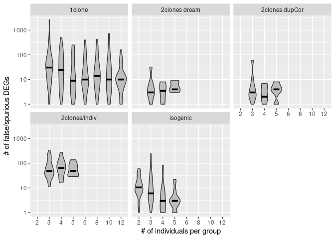
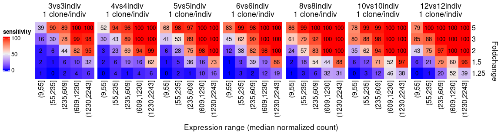
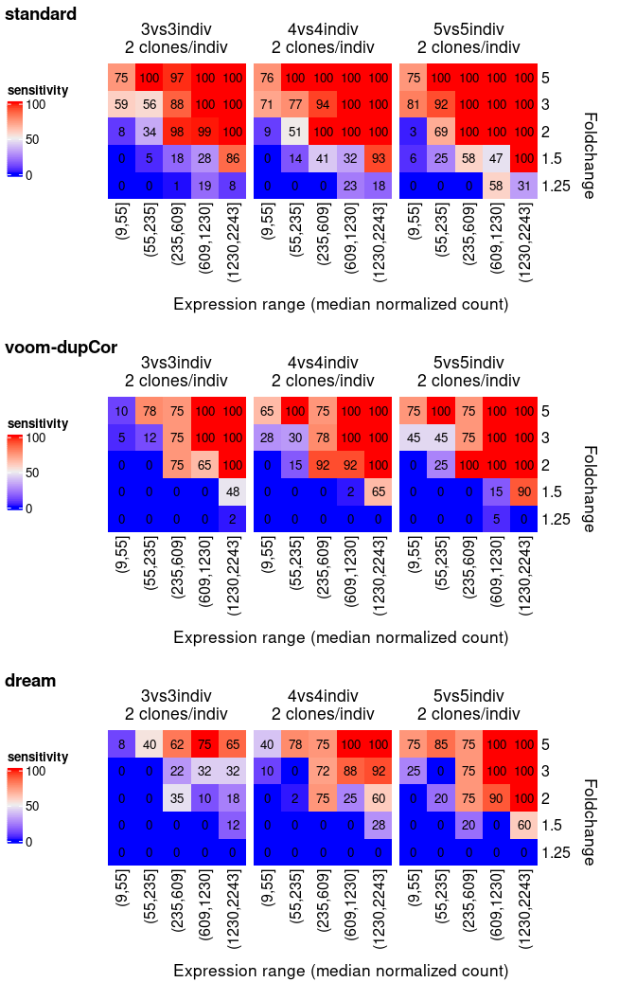
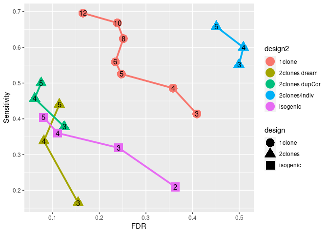

# Introduction

This file shows the results of recomputing the main permutation results
(on the HipSci dataset) from the
[paper](https://www.cell.com/stem-cell-reports/fulltext/S2213-6711(17)30219-9),
using up-to-date versions of the packages involved. We also include the
[dream method](https://www.bioconductor.org/packages/devel/bioc/vignettes/variancePartition/inst/doc/dream.html).

Note that these analyses are done with a relatively low number of
permutations (30, and only 10 for dream), and more permutations would be
needed to get more stable/trustworthy results.

```r
suppressPackageStartupMessages({
  library(BiocParallel)
  library(edgeR)
  library(grid)
  library(cowplot)
  library(ggplot2)
  library(iPSCpoweR)
})
```

# Running permutations and DEAs

Using the HipSci dataset:

```r
m <- aggByClone(getGeneExpr()) # pre-compile the expression matrix to save computing time
threads <- 6
maxTests <- 30 # more would be more stable/trustworthy
```

```r
# 2 clones
DEA.permutateIndividuals(nbIndividuals = 3, maxTests = maxTests, addDE=TRUE, ncores=threads, res = m)
DEA.permutateIndividuals(nbIndividuals = 4, maxTests = maxTests, addDE=TRUE, ncores=threads, res = m)
DEA.permutateIndividuals(nbIndividuals = 5, maxTests = maxTests, addDE=TRUE, ncores=threads, res = m)
# 1 clones
DEA.permutateIndividuals(nbIndividuals = 3, maxTests = maxTests, addDE=TRUE, ncores=threads, nbClone=1, useOnlyMulticlone = FALSE, res = m)
DEA.permutateIndividuals(nbIndividuals = 4, maxTests = maxTests, addDE=TRUE, ncores=threads, nbClone=1, useOnlyMulticlone = FALSE, res = m)
DEA.permutateIndividuals(nbIndividuals = 5, maxTests = maxTests, addDE=TRUE, ncores=threads, nbClone=1, useOnlyMulticlone = FALSE, res = m)
DEA.permutateIndividuals(nbIndividuals = 6, maxTests = maxTests, addDE=TRUE, ncores=threads, nbClone=1, useOnlyMulticlone = FALSE, res = m)
DEA.permutateIndividuals(nbIndividuals = 8, maxTests = maxTests, addDE=TRUE, ncores=threads, nbClone=1, useOnlyMulticlone = FALSE, res = m)
DEA.permutateIndividuals(nbIndividuals = 10, maxTests = maxTests, addDE=TRUE, ncores=threads, nbClone=1, useOnlyMulticlone = FALSE, res = m)
DEA.permutateIndividuals(nbIndividuals = 12, maxTests = maxTests, addDE=TRUE, ncores=threads, nbClone=1, useOnlyMulticlone = FALSE, res = m)
# isogenics
DEA.permutateClones(nbIndividuals = 2, maxTests = maxTests, addDE=TRUE, ncores=threads, res = m)
DEA.permutateClones(nbIndividuals = 3, maxTests = maxTests, addDE=TRUE, ncores=threads, res = m)
DEA.permutateClones(nbIndividuals = 4, maxTests = maxTests, addDE=TRUE, ncores=threads, res = m)
DEA.permutateClones(nbIndividuals = 5, maxTests = maxTests, addDE=TRUE, ncores=threads, res = m)
```


```r
# 2 clones with voom
DEA.permutateIndividuals(nbIndividuals = 3, maxTests = maxTests, addDE=TRUE, ncores=threads, fasterCombinations = TRUE, res = m, nested=TRUE, DEAfunc = voomWrapper)
DEA.permutateIndividuals(nbIndividuals = 4, maxTests = maxTests, addDE=TRUE, ncores=threads, res = m, nested=TRUE, DEAfunc = voomWrapper)
DEA.permutateIndividuals(nbIndividuals = 5, maxTests = maxTests, addDE=TRUE, ncores=threads, res = m, fasterCombinations = TRUE, nested=TRUE, DEAfunc = voomWrapper)
for(f in list.files(pattern="nested\\.")) file.rename(f,gsub("nested","nestedVoom",f))
```

```r
dreamWrapper <- function(e, mm=NULL, nested=NULL, DEsamples=NULL, paired=NULL){
  library(limma)
  library(variancePartition)
  stopifnot(!is.null(nested))
  d <- data.frame(row.names=colnames(e), group=rep("B",ncol(e)), stringsAsFactors=F)
  d$group[DEsamples] <- "A"
  d$individual <- nested
  form <- ~group+(1|individual)
  dds <- DGEList(e)
  dds <- calcNormFactors(dds)
  vobjDream = suppressWarnings(voomWithDreamWeights( dds, form, d, BPPARAM=BP, quiet=TRUE ))
  fitmm = suppressWarnings(dream( vobjDream, form, d, BPPARAM=BP, quiet=TRUE ))
  res <- as.data.frame(topTable( fitmm, coef='groupB', number=Inf ))[row.names(e),]
  return(data.frame(row.names=row.names(res), logFC=res$logFC, PValue=res$P.Value, FDR=res$adj.P.Val))
}

# 2 clones with dream
# since this is slow we run it only with 10 permutations; run with more to get more stable results
BP = MulticoreParam(threads, progressbar=TRUE)
DEA.permutateIndividuals(nbIndividuals = 3, maxTests = 10, addDE=TRUE, ncores=1, res = m, nested=TRUE, DEAfunc = dreamWrapper)
DEA.permutateIndividuals(nbIndividuals = 4, maxTests = 10, addDE=TRUE, ncores=1, res = m, nested=TRUE, DEAfunc = dreamWrapper)
DEA.permutateIndividuals(nbIndividuals = 5, maxTests = 10, addDE=TRUE, ncores=1, res = m, fasterCombinations = TRUE, nested=TRUE, DEAfunc = dreamWrapper)
for(f in list.files(pattern="nested\\.")) file.rename(f,gsub("nested","nestedDream",f))
```

# Overview of the results

## False positives (i.e. spurious DEGs)

```r
res <- readPermResults(list.files(pattern="RData"))
x <- lapply(res, FUN=function(x) x$FP)
d <- data.frame(design=rep(names(res),lengths(x)), FP=unlist(x), TP=unlist(lapply(res, FUN=function(x) x$TP)))
d$FDR <- d$FP/(d$FP+d$TP)
d$design2 <- ifelse(grepl("clones",d$design), "isogenic", ifelse(grepl("nested|\\.2$",d$design), "2clones/indiv", "1clone"))
d$design2[grepl("Voom",d$design)] <- "2clones dupCor"
d$design2[grepl("Dream",d$design)] <- "2clones dream"
d$nbIndiv <- as.integer(gsub("indiv\\.vs\\.[0-9]+indiv\\.?[1-2]?|\\.nested.+$|clones\\.|indiv$", "", d$design))
ggplot(d, aes(x=factor(nbIndiv), y=FP, group=factor(nbIndiv))) + geom_violin(fill="grey") + facet_wrap(~design2) + 
  scale_y_log10() + labs(x="# of individuals per group", y="# of false/spurious DEGs") +
  stat_summary(fun=median, geom = "crossbar", width = 0.5)
```



## Sensitivity


### 1 clone per individual 

```{r, fig.width=12, fig.height=3}
lf <- list.files(pattern="indiv\\.1.+RData")
lf <- lf[order(as.integer(gsub("indiv\\.vs\\.[0-9]+indiv\\.[1-2]\\.RData","",lf)))]
res <- readPermResults(lf)
getSensitivityMatrices(res)
```



### 2 clones per individual

```{r, fig.width=6, fig.height=3}
### Standard pipeline
lf <- list.files(pattern="indiv\\.2\\.RData")
lf <- lf[order(as.integer(gsub("indiv\\.vs\\.[0-9]+indiv\\.[1-2]\\.RData","",lf)))]
res <- readPermResults(lf)
p1 <- grid.grabExpr(getSensitivityMatrices(res))

### Voom
lf <- list.files(pattern="indiv\\.2\\.nestedVoom.RData")
res <- readPermResults(lf)
p2 <- grid.grabExpr(getSensitivityMatrices(res))

### Dream
lf <- list.files(pattern="indiv\\.2\\.nestedDream.RData")
res <- readPermResults(lf)
p3 <- grid.grabExpr(getSensitivityMatrices(res))
```

```{r, fig.width=7, fig.height=9}
plot_grid(
  p1, p2, p3, ncol=1, scale=0.9, hjust=0,
  labels=c(" standard"," voom-dupCor"," dream")
)
```



## FDR

```r
d2 <- aggregate(d[,c("TP","FDR")], by=d[,c("design2","nbIndiv")], na.rm=TRUE, FUN=mean)
d2$design <- gsub(" dupCor| dream|/indiv","",d2$design2)
ggplot(d2, aes(x=FDR, y=TP/100, colour=design2, shape=design, label=nbIndiv)) + 
  geom_path(size=1.3) + geom_point(size=6) + geom_text(colour="black") + ylab("Sensitivity")
```




# Session info

```
    sessionInfo()

    ## R version 4.1.1 (2021-08-10)
    ## Platform: x86_64-pc-linux-gnu (64-bit)
    ## Running under: Ubuntu 21.04
    ## 
    ## Matrix products: default
    ## BLAS:   /usr/lib/x86_64-linux-gnu/blas/libblas.so.3.9.0
    ## LAPACK: /usr/lib/x86_64-linux-gnu/lapack/liblapack.so.3.9.0
    ## 
    ## locale:
    ##  [1] LC_CTYPE=en_US.UTF-8       LC_NUMERIC=C              
    ##  [3] LC_TIME=de_CH.UTF-8        LC_COLLATE=en_US.UTF-8    
    ##  [5] LC_MONETARY=de_CH.UTF-8    LC_MESSAGES=en_US.UTF-8   
    ##  [7] LC_PAPER=de_CH.UTF-8       LC_NAME=C                 
    ##  [9] LC_ADDRESS=C               LC_TELEPHONE=C            
    ## [11] LC_MEASUREMENT=de_CH.UTF-8 LC_IDENTIFICATION=C       
    ## 
    ## attached base packages:
    ## [1] grid      stats     graphics  grDevices utils     datasets  methods  
    ## [8] base     
    ## 
    ## other attached packages:
    ## [1] ComplexHeatmap_2.8.0 pheatmap_1.0.12      iPSCpoweR_0.5       
    ## [4] ggplot2_3.3.5        cowplot_1.1.1        edgeR_3.34.0        
    ## [7] limma_3.48.3         BiocParallel_1.26.2 
    ## 
    ## loaded via a namespace (and not attached):
    ##  [1] Rcpp_1.0.7          locfit_1.5-9.4      circlize_0.4.13    
    ##  [4] lattice_0.20-45     png_0.1-7           assertthat_0.2.1   
    ##  [7] digest_0.6.27       foreach_1.5.1       utf8_1.2.2         
    ## [10] R6_2.5.1            stats4_4.1.1        evaluate_0.14      
    ## [13] highr_0.9           pillar_1.6.2        GlobalOptions_0.1.2
    ## [16] rlang_0.4.11        magick_2.7.3        S4Vectors_0.30.0   
    ## [19] GetoptLong_1.0.5    rmarkdown_2.11      labeling_0.4.2     
    ## [22] stringr_1.4.0       munsell_0.5.0       compiler_4.1.1     
    ## [25] xfun_0.26           pkgconfig_2.0.3     BiocGenerics_0.38.0
    ## [28] shape_1.4.6         htmltools_0.5.2     tidyselect_1.1.1   
    ## [31] tibble_3.1.4        IRanges_2.26.0      codetools_0.2-18   
    ## [34] matrixStats_0.60.1  fansi_0.5.0         crayon_1.4.1       
    ## [37] dplyr_1.0.7         withr_2.4.2         gtable_0.3.0       
    ## [40] lifecycle_1.0.0     DBI_1.1.1           magrittr_2.0.1     
    ## [43] scales_1.1.1        stringi_1.7.4       farver_2.1.0       
    ## [46] doParallel_1.0.16   ellipsis_0.3.2      generics_0.1.0     
    ## [49] vctrs_0.3.8         rjson_0.2.20        RColorBrewer_1.1-2 
    ## [52] iterators_1.0.13    tools_4.1.1         Cairo_1.5-12.2     
    ## [55] glue_1.4.2          purrr_0.3.4         parallel_4.1.1     
    ## [58] fastmap_1.1.0       yaml_2.2.1          clue_0.3-59        
    ## [61] colorspace_2.0-2    cluster_2.1.2       knitr_1.34
```

